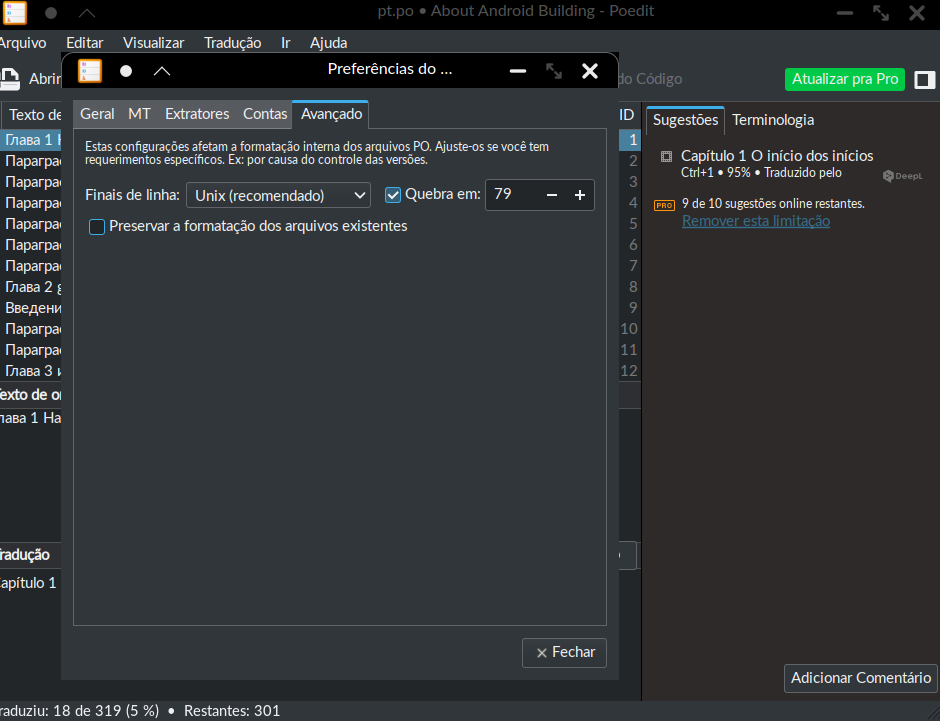

# Traduções do `Livro sobre a construção do Android`

> **Importante:**
> Este .md foi criado de [google/comprehensive-rust](https://github.com/google/comprehensive-rust/blob/main/TRANSLATIONS.md).
> Agradeça a eles por isso

Gostaríamos muito de contar com sua ajuda para traduzir o livro para outros idiomas! 

Usamos o sistema [Gettext] para traduções. Isso significa que você não modifica os arquivos Markdown diretamente:
em vez disso, você modifica os arquivos `.po` que estão no diretório `po/`. O arquivo `.po` são pequenos bancos de dados de 
tradução baseados em texto.

> **Dica:** Você não deve editar os arquivos `.po` manualmente. Em vez disso, use um editor PO, como [Poedit](https://poedit.net/).
> Existem também vários editores online disponíveis. Isso garantirá que o arquivo seja codificado corretamente.

> **Importante:** Se você planeja usar o [Poedit](https://poedit.net/) conforme sugerido acima, certifique-se de seguir a parte de
> [configuração adicional etapas](#Additional-Configuration-Steps-for-Poedit) abaixo para garantir que o arquivo `.po` esteja
> formatado corretamente.

Existe um arquivo `.po` para cada idioma. Eles são nomeados de acordo com os códigos de idioma [ISO 639]: o dinamarquês entraria 
em `po/da.po`, o coreano iria para `po/ko.po`, etc. Os arquivos `.po` contêm todo o texto em inglês mais as traduções. Eles são 
inicializados a partir de um arquivo `messages.pot` (arquivo PO modelo) que contém apenas o texto em inglês.

Mostraremos como atualizar e manipular os arquivos `.po` e `.pot` usando os utilitários GNU Gettext abaixo.

[Gettext]: https://www.gnu.org/software/gettext/manual/html_node/index.html
[ISO 639]: https://en.wikipedia.org/wiki/List_of_ISO_639-1_codes

## Preparação

Você precisará dos utilitários [Gettext] (`msginit`, `msgmerge`). No Debian e Ubuntu, você pode instalar com:

```shell
sudo apt install gettext
```

Certifique-se de que você pode construir o livro e que `mdbook serve` funcione. Para isso, siga as instruções do [README](README.md).

## Criando e atualizando traduções

Primeiro, você precisa saber como atualizar os arquivos `.pot` e `.po`.

Como regra geral, você nunca deve tocar no arquivo `po/messages.pot` gerado automaticamente. Você também não deve editar as partes 
de `msgid` no arquivo `po/xx.po`. Se você encontrar erros, será necessário atualizar o texto original em inglês. As correções no texto 
em inglês irão para os arquivos `.po` na próxima vez que os tradutores os atualizarem.

### Gerando o modelo de pedido de compra

Para extrair o texto original em inglês e gerar um arquivo `messages.pot`, você deve executar `mdbook` com um renderizador especial:

```shell
MDBOOK_OUTPUT='{"xgettext": {"pot-file": "messages.pot"}}' \
  mdbook build -d po
```

Você encontrará o arquivo POT gerado como `po/messages.pot`.

### Inicialize uma nova tradução

Para iniciar uma nova tradução, primeiro gere o arquivo `po/messages.pot`. Em seguida, use `msginit` para criar um arquivo `xx.po`
para um idioma fictício `xx`:

```shell
msginit -i po/messages.pot -l xx -o po/xx.po
```

Você também pode simplesmente copiar `po/messages.pot` para `po/xx.po`. Em seguida, atualize o arquivo cabeçalho (a primeira entrada
com `msgid ""`) para o idioma correto.

> **Dica:** você pode usar a ferramenta [`cloud-translate`](https://github.com/mgeisler/cloud-translate) para traduzir
> automaticamente uma nova tradução rapidamente. Instale-o com:
>
> ```shell
> cargo install cloud-translate
> ```
>
> As entradas não traduzidas serão enviadas pelo GCP Cloud Translate. Algumas das traduções estarão erradas depois disso, então
> você deve revisá-los manualmente depois.

A seguir, atualize o arquivo `LANGUAGES` para incluir o novo idioma:

```diff
- uk
+ uk ko
```

### Atualizando uma tradução existente

À medida que o texto em inglês muda, as traduções tornam-se gradualmente desatualizadas. Para atualizar o arquivo `po/xx.po` com 
novas mensagens, primeiro extraia o texto em inglês para um arquivo de modelo `po/messages.pot`. Então execute:

```shell
msgmerge --update po/xx.po po/messages.pot
```

As mensagens inalteradas permanecerão intactas, as mensagens excluídas serão marcadas como antigas e as mensagens atualizadas serão 
marcadas como difusas/"fuzzy". Uma entrada confusa reutilizará a tradução anterior: você deverá revisá-la e atualizá-la conforme 
necessário antes de remover o marcador difuso.

> **Nota:** Seus PRs devem ser o resultado da execução de `msgmerge` ou o resultado de um novo trabalho de tradução no arquivo PO
> para o seu idioma. Evite misturar os dois, pois isso geralmente cria uma diferença muito grande, que é difícil ou impossível de revisar.

### Editando uma tradução

Você deve instalar um editor PO para editar o arquivo `.po` para o seu idioma. Os arquivos são arquivos de texto simples, mas ajuda usar 
um editor dedicado, pois ele cuidará de escapar de coisas como `"` corretamente.

Existem muitos editores de PO disponíveis. [Poedit](https://poedit.net/) é uma escolha popular entre plataformas, mas você também pode 
encontrar vários editores online.

#### Configuração Adicional para Poedit

Se você estiver usando [Poedit](https://poedit.net/) para trabalhar com seu arquivo `.po`, você precisará alterar algumas opções na
configuração padrão:
 * Windows / MacOS
1. Abra a caixa de diálogo **Configurações**
   1. No Windows, vá para **Arquivo/Configurações**
   1. No MacOS, selecione **Configurações** no item de menu **Poedit**
1. Vá para a guia **Avançado**
1. Em **Finais de linha**, selecione a opção **Unix (recomendado)**
1. Marque a caixa **Quebra em**/Wrap at e **79** na caixa de texto
1. _**Desmarque**_ a caixa **Preservar a formatação dos arquivos existentes**


 * Linux OS

   Você precisará alterar somente a opção
5. _**Desmarque**_ a caixa **Preservar a formatação dos arquivos existentes**



## Usando traduções

Isso mostrará como usar as traduções para gerar a saída localizada do arquivo HTML.

> **Nota:** `mdbook` usará entradas originais não traduzidas para todas as entradas marcadas como "fuzzy" (visível como "Necessita de
> trabalho" no Poedit). Isso é especialmente importante ao usar [`cloud-translate`](https://github.com/mgeisler/cloud-translate) para
> a tradução inicial, pois todas as entradas serão marcadas como "fuzzy".

### Construindo uma tradução

Para usar o arquivo `po/xx.po` para sua saída, execute o seguinte comando:

```shell
MDBOOK_BOOK__LANGUAGE=xx mdbook build -d book/xx
```

Isto atualizará o idioma do livro para `xx`, fará com que o pré-processador `mdbook-gettext` se torne ativo e instrua-o a usar
o arquivo `po/xx.po` e, finalmente, redirecionará a saída para `book/xx`.

### Mantendo uma tradução

Como normalmente, você pode usar `mdbook serve` para visualizar sua tradução enquanto trabalha nela. Você usa o mesmo comando que 
faz `mdbook build` acima:

```shell
MDBOOK_BOOK__LANGUAGE=xx mdbook serve -d book/xx
```

Quando você atualiza o arquivo `po/xx.po`, o livro traduzido será recarregado automaticamente.

## Reviewing Translations

When a new translation is started, we look for people who can help review it. These reviewers are often Googlers, but 
they don't have to be.

When reviewing a translation, please keep in mind that translations are a labour of love. Someone spends their free time 
translating the book because they want to bring Android to users who want to build this OS.

Nothing is published right away after a PR lands for a new in-progress language. It is therefore safe to merge the PR as 
long as the translation is reasonable. This is often better than leaving 50+ comments since this can be overwhelming
for the contributor. Instead, please work with the contributor to improve things in follow-up PRs.

### GitHub Suggestions

When reviewing a translation PR, please use the
[GitHub suggestion feature](https://docs.github.com/en/pull-requests/collaborating-with-pull-requests/reviewing-changes-in-pull-requests/commenting-on-a-pull-request).
This feature allows you to directly write how you think a line or paragraph should be phrased. Use the left-most button 
in the toolbar to create a suggestion.

The PR author can
[apply the changes with a single click](https://docs.github.com/en/pull-requests/collaborating-with-pull-requests/reviewing-changes-in-pull-requests/incorporating-feedback-in-your-pull-request)
afterwards, drastically reducing the number of round-trips needed in a review.
